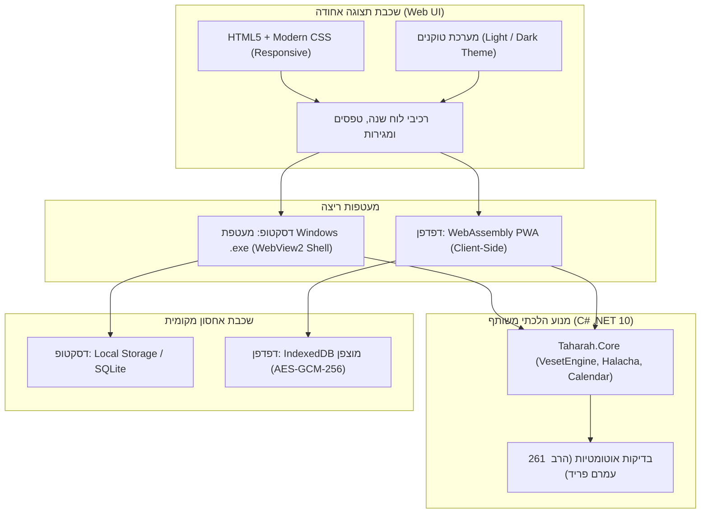
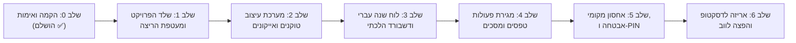

# אפיון תוכנית עבודה: גרסה משולבת דסקטופ ודפדפן (הרב עמרם פריד)

> **מהות הפרויקט:** פיתוח גרסה מאוחדת ומודרנית של "לוח טהרה" שבה ממשק המשתמש נבנה כולו בטכנולוגיות ווב (HTML5 / Modern CSS / Responsive Design) בעיצוב נקי וחדשני של דפדפן, ופועל במקביל:
> 1. כתוכנת דסקטופ עצמאית למחשב (Windows .exe) ללא תלות ברשת.
> 2. כאתר אינטרנט / אפליקציית רשת (Web / PWA) הנגישה מכל דפדפן ומכל מכשיר (כולל סמארטפונים).
> 
> **שתי הפלטפורמות חולקות 100% מאותו מנוע הלכתי מאומת (`Taharah.Core`), ללא שינוי או שכפול לוגיקה, עם כל 261 הבדיקות האוטומטיות של פסיקות הרב עמרם פריד שליט"א.**

---

## 1. רקע ומטרות

### 1.1 הבעיה הנוכחית
- גרסת ה-WPF לדסקטופ נבנתה ב-XAML שמותאם למסכי מחשב בלבד, עם מורכבות עיצובית וכובד בתחזוקת ממשק.
- גרסת ה-JS הקיימת החזיקה מימוש נפרד בלוגיקה, דבר המקשה על שמירת אחידות הלכתית מול ספרי הרב עמרם פריד.
- המשתמש מעוניין בחוויית משתמש קלה, מודרנית ונקייה כשל אתר אינטרנט עדכני, הפועלת גם כתוכנת שולחן עבודה מקומית וגם בדפדפן.

### 1.2 יעדי הפרויקט
1. **עיצוב Web מודרני, אוורירי ואינטואיטיבי:** ממשק נקי, פריסה רספונסיבית המתאימה גם למסך מלא וגם למובייל, ביטול עומס חזותי, מעברים חלקים, וכפתורים גדולים ונגישים.
2. **אפס פשרות על הלכה:** הסתמכות מלאה על ספריית `Taharah.Core` ב-C# (.NET 10) שכבר עברה בדיקות אימות מקיפות ומכסה 100% מהאירועים והחישובים.
3. **פתרון אחסון מקומי ופרטיות מוחלטת:** אפס תלות בשרתים מרוחקים. הנתונים מוצפנים ונשמרים אך ורק במכשיר המשתמשת (דסקטופ או דפדפן).
4. **עצמאות מלאה:** הפרויקט מתנהל בתיקיית אב ייעודית חדשה (`דסקטופ משולב עם עיצוב דפדפן (הרב עמרם פריד)`), מבלי לפגוע בגרסאות הקיימות.

---

## 2. ארכיטקטורה טכנולוגית

### 2.1 בחירת המחסנית הטכנולוגית (Tech Stack)
* **טכנולוגיית הליבה: Blazor (WebAssembly + Desktop Hybrid):**
  - מאפשרת ל-`Taharah.Core` (קוד C# קיים) לרוץ **ישירות בדפדפן** באמצעות WebAssembly, ובדסקטופ באמצעות WebView2 קל ומהיר.
  - כל קוד ה-UI נכתב ב-**HTML5 ו-CSS3 נקיים**, בדיוק כמו באתר אינטרנט מודרני.
  - אין צורך לשכתב אף שורת לוגיקה ל-JS, ואין סיכון לרגרסיות או טעויות תרגום הלכתיות.
* **חלופת גיבוי:** Single Page Application (HTML/CSS/JS) עם חיבור מקומי או אריזת Electron/PWA.

---

## 3. עקרונות עיצוב וממשק (UI/UX Design Standards)

> **אב-טיפוס חי ומאושר:** כל עקרונות הממשק והעיצוב שלהלן מומשו, נבדקו ואושרו בקובץ הדגם:
> [`mockup_preview.html`](file:///c:/Users/משתמש/Downloads/פרוייקטים/לוח%20טהרה/דסקטופ%20משולב%20עם%20עיצוב%20דפדפן%20(הרב%20עמרם%20פריד)/mockup_preview.html).

1. **תפיסה עיצובית: "אווריריות, רכות וביטחון הלכתי"**
   - **מבנה כרטיסים אורגני במקום גריד נוקשה:** כל יום בלוח השנה הוא כרטיס עצמאי עם פינות מעוגלות ורכות (`border-radius: 16px`), מרווחים נדיבים (`gap: 8px`), וללא קווים זוויתיים קשים או קווי טבלה צפופים.
   - **הדגשת יום בחירה צפה ועדינה:** יום שנבחר בלוח מקבל הגבהה קלה (`translateY(-3px)`), צל דיפוזי רך, ופס הדגשה מינימליסטי ויוקרתי בחלק העליון — **ללא מסגרות שחורות או כהות כבדות**.
   - **דשבורד עליון אטמוספרי (Halo Hero Card):** כרטיס סטטוס רחב בעל הילת אור רכה ונשימתית, ציר שבעה נקיים עם תחנות מעוגלות ומודגשות, שעת שקיעה מובלטת והנחיה לפעולה הקרובה.

2. **איקונוגרפיה וקטורית מקצועית (אפס אימוג'ים):**
   - **איסור מוחלט על אימוג'ים במערכת כולה.**
   - כל הסמלים נבנים מאייקונים וקטוריים נקיים (SVG) בעובי קו אחיד ועדין (`1.8px`).
   - **אייקונים מונפשים בעדינות (Subtle Living Motion):**
     - **טבילה במקווה:** גלי מים חיים נעים בזרימה איטית ומרגיעה (`icon-waves`).
     - **הפסק טהרה:** עלה/ענף זית שנושם ונע ברכות (`icon-leaf`).
     - **שמש וירח:** שמש מסתובבת לאיטה וירח נוטה בעדינות לחלוקת יום ולילה.
     - **בדיקת שבעה נקיים:** עדשת בדיקה נקייה עם הדגשה רכה (`icon-lens`).

3. **רגישות עיצובית ונשית (Dignified & Sensitive UX):**
   - **ביטול מוחלט של טיפות דם או דימויים מרתיעים.**
   - אירוע ראייה/וסת מוצג באמצעות **סמל פריחה/מעגל מעודן (Cycle Blossom)** המייצג את תחילת המחזור, תחת השם המכבד **"תחילת מחזור (ראייה)"**, בגוון עלי כותרת עדין ונעים (`#FDF2F4` / `#9F2241`), ללא צבעים מאיימים.

4. **פתרון חלוקת יום ולילה בהלכה:**
   - כל כרטיס יום מחולק בצורה נקייה לרצועת לילה עליונה (🌙 עונת הלילה שקודמת ליום העברי) ולרצועת יום תחתונה (☀️ עונת היום), מה שמונע 100% מטעויות המשתמשים לגבי מועדי פרישות ובדיקות.

5. **מיקרו-אינטראקציות ותנועה (Micro-interactions):**
   - פתיחת מגירת הפעולות בפיזיקת קפיץ חלקה (Spring Physics של 60fps).
   - פידבק טקטילי בלחיצה על כפתורי פעולה (`scale: 0.96`), וריחוף עדין (`scale: 1.15`) של סמלי הפעולות.
   - מעבר חלק כמשי בין מצב יום פנינתי בהיר למצב לילה Obsidian/Velvet יוקרתי ועמוק.

---

## 4. תוכנית עבודה מפורטת (6 שלבים)

### שלב 0: הקמת התיקייה ואימות הליבה (הושלם בהצלחה ✅)
- [x] יצירת תיקיית האב: `דסקטופ משולב עם עיצוב דפדפן (הרב עמרם פריד)`.
- [x] העתקת ספריות הליבה: `src/Taharah.Core`, `src/Taharah.Infrastructure`, וסוויטת הבדיקות `tests/Taharah.Core.Tests`.
- [x] הרצת `dotnet test`: **כל 261 הבדיקות עוברות בהצלחה מלאה (100% ירוק)** בסביבה החדשה.
- [x] בנייה, עידון ואישור של אב-טיפוס ממשקי ועיצובי מלא (`mockup_preview.html`).

### שלב 1: הקמת שלד ה-Web ומעטפת הדסקטופ (Hybrid Architecture)
- הקמת פרויקט ה-UI המודרני (Blazor Hybrid / Web Components).
- יצירת מעטפת הדסקטופ העצמאית (Windows .exe באמצעות WebView2) המריצה את ממשק ה-Web באופן מקומי וקל ללא צורך ברשת.
- יצירת מעטפת ה-Web/PWA (WebAssembly) המאפשרת ריצה ישירה מכל דפדפן וסמארטפון.
- חיבור ישיר של שתי המעטפות לפרויקט ה-C# המאומת `Taharah.Core`.

### שלב 2: מערכת עיצוב, טוקנים ואיקונוגרפיה וקטורית (Design System)
- הטמעת קובצי ה-CSS של מערכת העיצוב המאושרת:
  - סולם משתני CSS (טוקנים לצבעים, ריווחים, צללים דיפוזיים ופינות מעוגלות 16px).
  - טיפוגרפיה עברית מתקדמת (Assistant ו-Plus Jakarta Sans למספרים).
  - ערכת נושא מלאה למצב יום ולמצב לילה (Obsidian/Slate).
- הטמעת ספריית האייקונים הווקטוריים (SVG) המונפשים:
  - סמל תחילת מחזור (Cycle Blossom).
  - ענף זית להפסק טהרה.
  - עדשת בדיקה לשבעה נקיים.
  - גלי מים חיים לטבילה.
  - סמלי שמש וירח מונפשים.

### שלב 3: לוח שנה עברי ודשבורד עליון (Calendar & Hero Dashboard)
- בניית רכיב לוח השנה החודשי והשנתי במבנה כרטיסים צפים ואורגניים:
  - תאריך עברי בולט לצד תאריך לועזי ושעת שקיעה.
  - חלוקת רצועות יום ולילה בתוך כל כרטיס יום.
  - תגיות פרישה מעוצבות (עו"ב, הפלגה, יום החודש, אור זרוע).
  - סימון בחירה צף ויוקרתי ללא מסגרות כבדות.
- פיתוח הדשבורד העליון (Hero Halo Card):
  - הצגת הסטטוס ההלכתי הנוכחי עם הילת אור נשימתית.
  - פס התקדמות שבעה נקיים (Stepper).
  - תזכורת מיידית לזמן שקיעת החמה והנחיה לפעולה הבאה.

### שלב 4: מגירת פעולות, טפסים מודרכים ומסכים משלימים
- פיתוח מגירת הפעולות הצדדית (Slide-in Drawer) עם אנימציית Spring של 60fps (ומצב Bottom Sheet בסמארטפונים).
- כפתורי פעולה מהירה עם פידבק טקטילי בלחיצה (תחילת מחזור, הפסק, בדיקה, טבילה, כתם, מיחוש).
- טפסים מודרכים (Guided Stepper): בחירת עונת יום/לילה ומשיכת ראייה בצורה אינטואיטיבית ומדויקת הלכתית.
- פיתוח מסכי ריכוז וסתות, תובנות מחזור, והמדריך ההלכתי לפי ספרי הרב עמרם פריד.

### שלב 5: מנגנון אחסון מקומי מוצפן ונעילת PIN
- שכבת אחסון מקומית מופשטת:
  - בדסקטופ: קובץ מוצפן מקומי בדיסק.
  - בדפדפן: IndexedDB מוצפן (AES-GCM-256) ללא שום תלות בשרת חיצוני (פרטיות מלאה).
- מסך נעילת PIN מזוגג עם מקלדת ספרות עגולה ונעילה אוטומטית.
- מנגנון ייצוא/ייבוא קובץ גיבוי JSON מוצפן.

### שלב 6: אריזה, הפצה ובדיקות שלמות
- הידור קובץ Windows יחיד ועצמאי (`.exe`) להפעלה ישירה.
- הפקת חבילת Web/PWA סטטית לשימוש חופשי מכל דפדפן ומכשיר נייד.
- הרצת כל 261 הבדיקות האוטומטיות של `Taharah.Core` ווידוא 100% מעבר ירוק ללא שינוי לוגיקה.
- בדיקות רספונסיביות מלאות על מסכי מחשב, טאבלטים וסמארטפונים.

---

## 5. סיכום תפוקות

| תוצר | תיאור | יעד |
| :--- | :--- | :--- |
| **תוכנת דסקטופ (.exe)** | קובץ יחיד, עיצוב נקי ויוקרתי, ללא אינטרנט, מנוע הרב עמרם פריד | הפצה למחשב |
| **גרסת דפדפן (Web/PWA)** | אתר ואפליקציה רספונסיבית מכל מכשיר, אחסון מקומי ופרטי | גישה מכל מקום |
| **חוויית משתמש ועיצוב** | כרטיסים אורגניים, ללא אימוג'ים, סמלים וקטוריים מונפשים, רגישות מלאה | חוויה מושלמת |
| **מנוע הלכתי מאומת** | `Taharah.Core` ב-C# עם 261 בדיקות ירוקות ללא שום שינוי | שמירת ההלכה |

